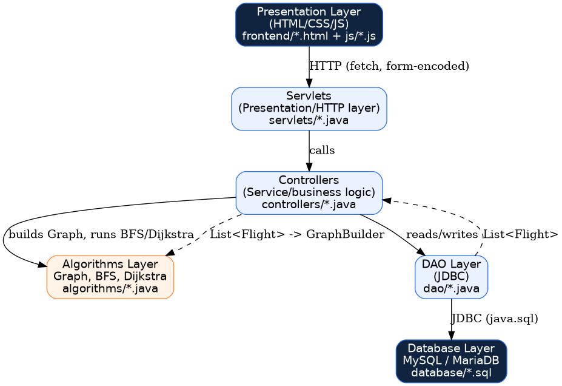
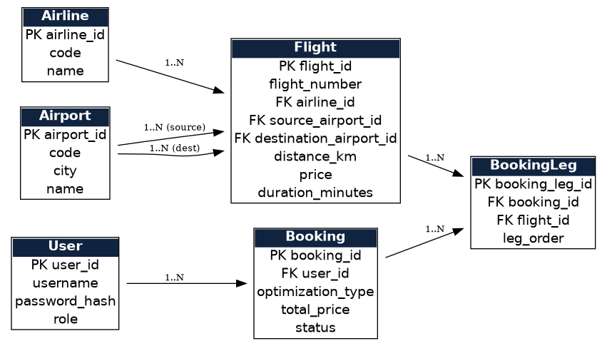

# ✈️ AirRouteX

### Graph-Based Airline Route Optimization System

AirRouteX is a Java-based airline route optimization system that models flight networks as graphs and finds optimal routes based on **distance, price, travel duration, and number of layovers**.

## ✨ Features

- 🔹 Shortest-distance route
- 🔹 Lowest-price route
- 🔹 Shortest-duration route
- 🔹 Minimum-layover route
- 🔹 User registration & login
- 🔹 Flight booking
- 🔹 Admin flight management
- 🔹 MySQL/MariaDB database integration

## 🧠 Algorithms

| Requirement | Algorithm |
|---|---|
| Shortest Distance | Dijkstra's Algorithm |
| Lowest Price | Dijkstra's Algorithm |
| Shortest Duration | Dijkstra's Algorithm |
| Minimum Layovers | BFS |

The flight network is represented using an **adjacency list** with:

```text
HashMap<Integer, List<Flight>>
🛠️ Tech Stack

Backend: Java 17, Java Servlets, JDBC
Frontend: HTML, CSS, JavaScript
Database: MySQL / MariaDB
Server: Apache Tomcat
DSA: Graph, Dijkstra, BFS, HashMap, PriorityQueue
Security: HttpSession, BCrypt

🏗️ Architecture

Frontend
   ↓
Java Servlets
   ↓
Route Optimization
(Dijkstra / BFS)
   ↓
DAO + JDBC
   ↓
MySQL / MariaDB
🗃️ Database Design

⚡ Complexity
Graph Construction: O(V + E)
BFS: O(V + E)
Dijkstra: O((V + E) log V)
📂 Project Structure
AirRouteX/
├── frontend/
├── backend/
│   └── src/com/airroutex/
│       ├── algorithms/
│       ├── controllers/
│       ├── dao/
│       ├── database/
│       ├── models/
│       ├── servlets/
│       └── utils/
├── database/
├── docs/
├── build.sh
└── README.md
🔐 Security
Passwords are protected using BCrypt hashing
User sessions are managed using HttpSession
Database credentials are kept outside the repository
📚 Documentation

Detailed complexity analysis and system diagrams are available in the docs/ directory.

👩‍💻 Author

Shivani Mohokar

GitHub

⭐ If you find AirRouteX interesting, consider giving the repository a star!
